<div align="center">

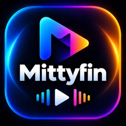

# Mittyfin

**Клиент Jellyfin для Android с настоящим Dolby Vision profile 7 FEL, собранным на GPU**

[](https://github.com/iMaks533/mittyfin/tags)


[](LICENSE)

</div>

Mittyfin — компактный клиент медиасервера [Jellyfin](https://jellyfin.org) в духе Yamby: тёмный
интерфейс, постеры, «Продолжить просмотр», карточки с логотипами. Главное в нём — плеер,
который показывает **Dolby Vision profile 7 с полным слоем улучшения (FEL)** на обычных
телефонах и приставках. Таких дисков в ремуксах большинство, а честно воспроизвести их
умеют лишь редкие плееры с двухслойным декодером Dolby. Mittyfin собирает кадр сам: два
аппаратных HEVC-декодера и шейдер на GPU.

<p align="center">
  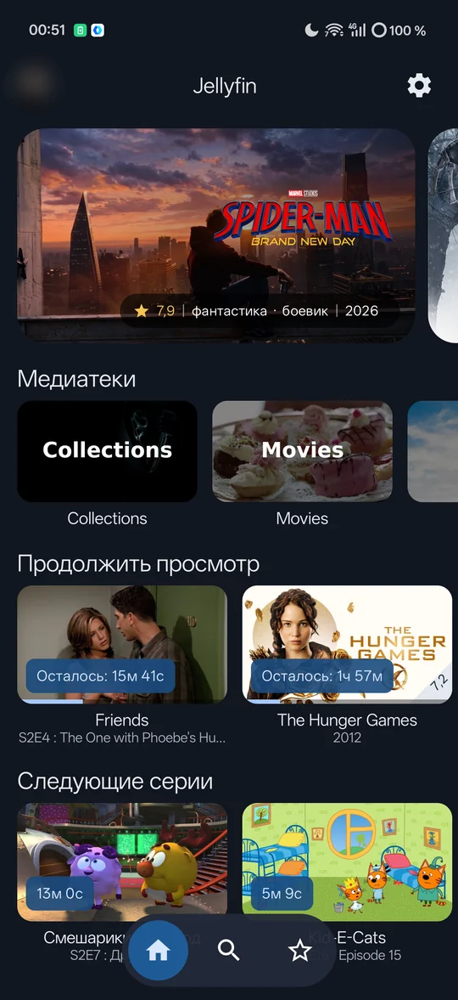
  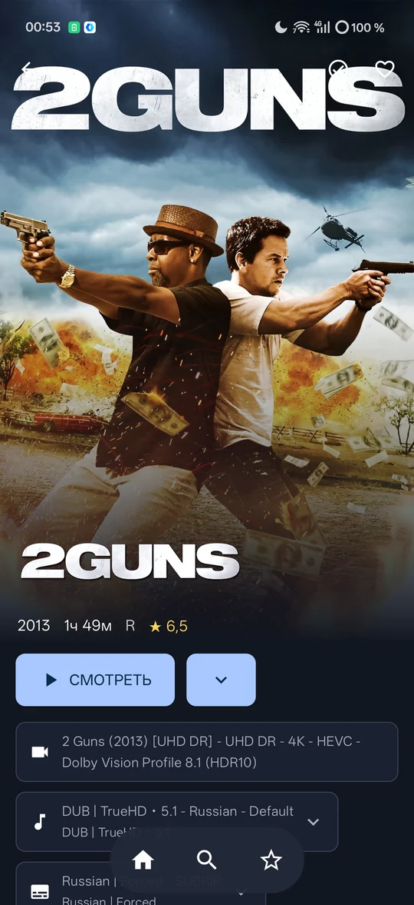
  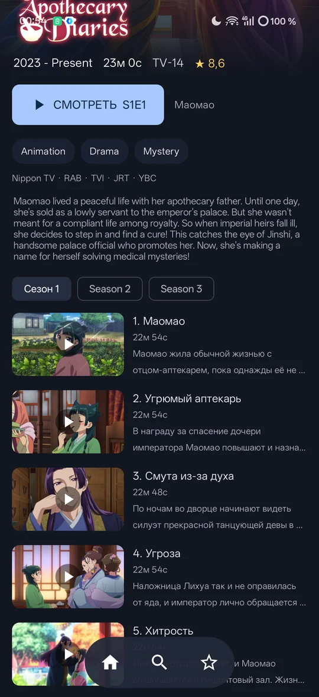
  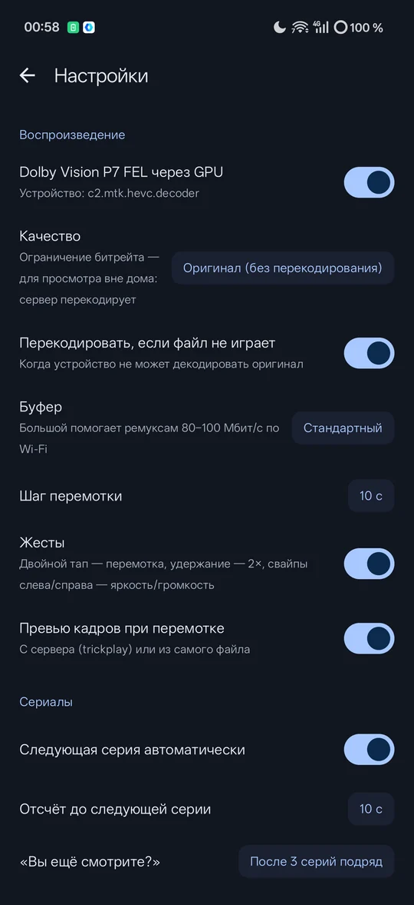
</p>
<p align="center">
  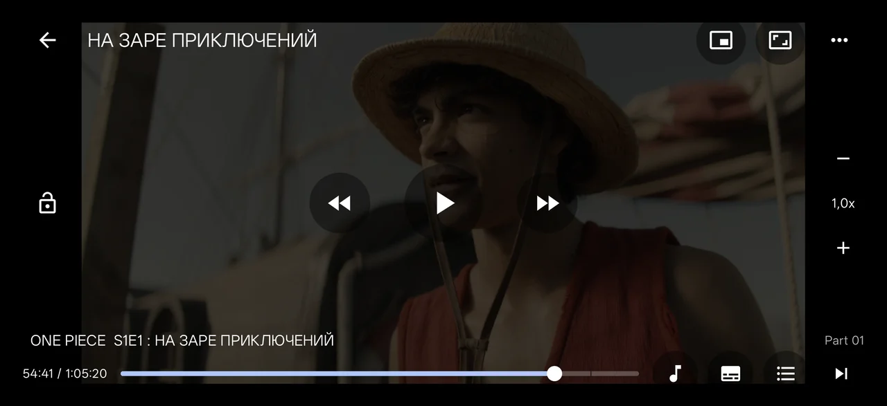
</p>

## Содержание

- [Коротко о главном](#коротко-о-главном)
- [Dolby Vision P7 FEL на GPU](#dolby-vision-p7-fel-на-gpu)
- [Каталог](#каталог)
  - [Вход](#вход) · [Главная](#главная) · [Медиатеки](#медиатеки-сортировка-и-фильтры) · [Поиск](#поиск) · [Избранное](#избранное) · [Карточка](#карточка-фильма-и-сериала)
- [Плеер](#плеер)
  - [Управление](#экран-и-кнопки) · [Жесты](#жесты) · [Пульт](#пульт-и-клавиатура) · [Дорожки](#звуковые-дорожки-и-субтитры-какие-выбираются-сами) · [Субтитры](#оформление-субтитров) · [Звук](#звук-задержка-и-усиление) · [Сериалы](#сериалы-пропуск-заставок-и-далее) · [Перемотка](#перемотка-главы-и-превью) · [PiP и таймер сна](#картинка-в-картинке-медиакнопки-таймер-сна) · [Частота экрана](#частота-экрана) · [Перекодирование](#перекодирование-и-ошибки) · [Статистика](#статистика)
- [Android TV](#android-tv)
- [Настройки](#настройки)
- [Установка](#установка)
- [Сборка из исходников](#сборка-из-исходников)
- [Версии и релизы](#версии-и-релизы)
- [Ограничения](#ограничения)
- [Благодарности и лицензия](#благодарности-и-лицензия)

## Коротко о главном

| | |
|---|---|
| 🎞️ **Dolby Vision P7 FEL** | Базовый слой, слой улучшения и метаданные RPU собираются в один кадр на GPU. Динамический тон-маппинг по сценам, HDR-вывод в PQ BT.2020 |
| 🔊 **Звук без компромиссов** | TrueHD, DTS-HD MA, FLAC — через FFmpeg, если на устройстве нет своего декодера. Задержка звука запоминается для каждого устройства вывода, есть усиление голосов в 5.1/7.1 |
| 💬 **Умные субтитры** | Сами включаются, когда звук не на вашем языке. libass для аниме, Windows-1251 без «кракозябр», удаление пометок для глухих |
| 📺 **Сериалы** | Пропуск заставок и титров (Intro Skipper), карточка «Далее» с отсчётом, панель серий прямо в плеере, «Вы ещё смотрите?» |
| 🧠 **Память по тайтлу** | Язык звука и субтитров, сдвиг субтитров и скорость запоминаются для фильма или для всего сериала |
| 🔁 **Не ломается** | Не играет файл — сервер перекодирует с той же секунды. Пропала сеть — до трёх переподключений. Завис поток — перезапуск |
| 📱 **Телефон и ТВ** | Жесты, блокировка экрана, картинка в картинке на телефоне. Левая панель, фокус и пульт на Android TV |
| ⏱️ **Плавная картинка** | Частота экрана подстраивается под фильм: 24p идёт на 120 Гц на телефоне и на 23,976 Гц на телевизоре |

## Dolby Vision P7 FEL на GPU

<p align="center">
  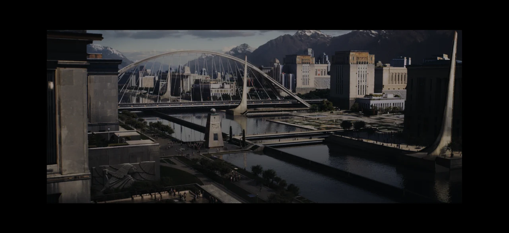
</p>
<p align="center"><sub>The Hunger Games (UHD Blu-ray, Dolby Vision profile 7 FEL) на OPPO Find X9 Pro: база + RPU + слой улучшения, собранные на GPU.</sub></p>

### Как увидеть, что FEL работает

**Тестовый ролик.** Надпись «THIS DEVICE CAN DECODE FEL» записана только в слое улучшения. Если EL
применён, она проступает поверх кадра (вживую мерцает). Если плеер выбросил EL — её нет.
Режим отображения переключается тапом по панели «Информация о медиа»: «BL + RPU + EL» → «without EL» → «EL residual ×32».

<table>
  <tr>
    <td align="center">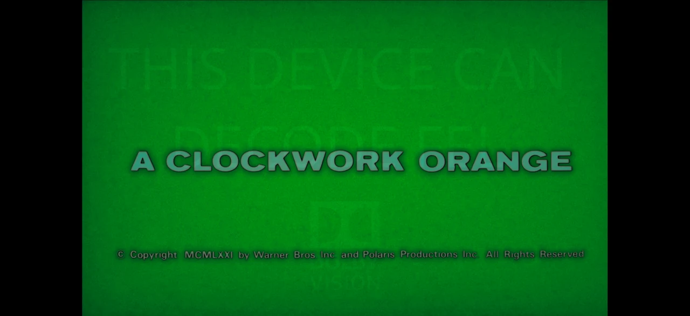<br><sub><b>С EL</b> — надпись видна</sub></td>
    <td align="center">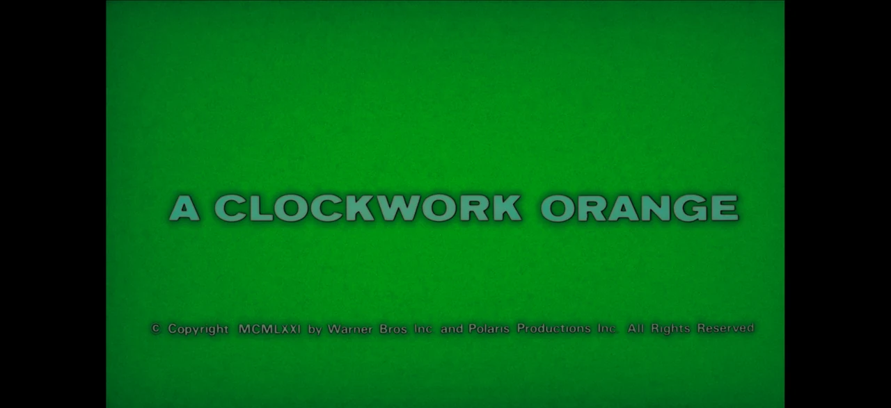<br><sub><b>Без EL</b> — надписи нет</sub></td>
  </tr>
  <tr>
    <td align="center">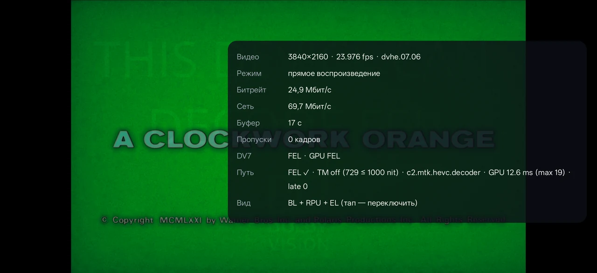<br><sub>Статистика: <code>DV7 FEL · GPU FEL</code>, <code>FEL ✓</code>, вид <code>BL + RPU + EL</code></sub></td>
    <td align="center"><br><sub>Тот же кадр в режиме <code>without EL</code></sub></td>
  </tr>
  <tr>
    <td align="center" colspan="2">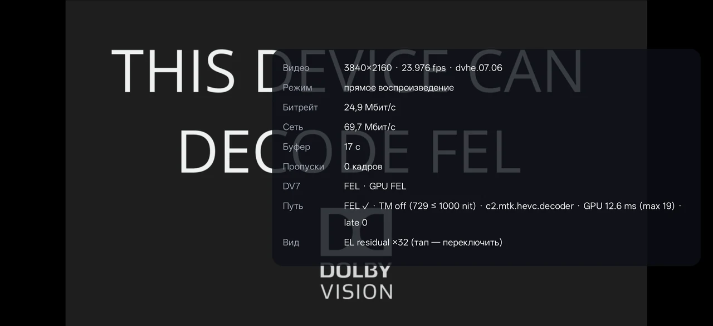<br><sub><code>EL residual ×32</code> — сам слой улучшения, усиленный в 32 раза</sub></td>
  </tr>
</table>

**Настоящий фильм.** В кино слой улучшения несёт не надписи, а мелкие детали, текстуры и
точность градаций. Глазом A/B на телефоне различается тонко, поэтому видно его в режиме остатка:

<table>
  <tr>
    <td align="center">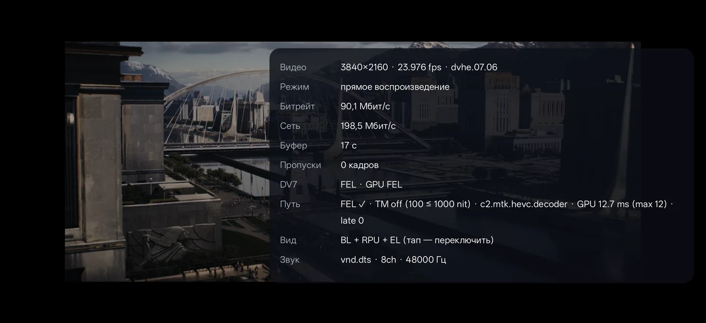<br><sub><code>BL + RPU + EL</code>: 3840×2160, 23.976 fps, 90 Мбит/с, <code>FEL ✓</code>, кадр на GPU 12,7 мс, 0 пропусков</sub></td>
    <td align="center"><br><sub>Тот же кадр <code>without EL</code></sub></td>
  </tr>
  <tr>
    <td align="center" colspan="2">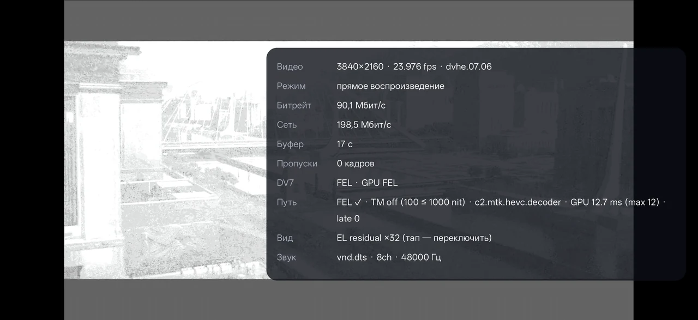<br><sub><code>EL residual ×32</code>: контуры зданий, моста и гор — то, что FEL добавляет к базовому слою</sub></td>
  </tr>
</table>

> Скриншоты HDR-кадров система сохраняет в SDR: яркие насыщенные цвета упираются в предел, и часть
> разницы теряется. На самом экране картинка ярче и контрастнее, а мерцание тестовой надписи видно только вживую.

### Зачем это нужно

Ремуксы UHD Blu-ray с Dolby Vision почти всегда в **profile 7**: под HDR10-базой лежит второй
видеослой (EL) и метаданные (RPU). У дисков с **FEL** (Full Enhancement Layer) слой улучшения
несёт реальные детали картинки, а не только метаданные. Обычные плееры его выбрасывают и
показывают голый HDR10. Двухслойный декодер Dolby есть в считаных приставках, а в телефонах
его нет совсем.

### Как это работает

```
            ┌─ BL 3840×2160 ─► HEVC-декодер №1 (P010) ─┐
 файл P7 ──►│                                          ├─► шейдер GLES 3.0 ─► тон-маппинг ─► экран
 (1 дорожка)├─ EL 1920×1080 ─► HEVC-декодер №2 (P010) ─┤    reshaping BL      BT.2390        PQ BT.2020
            └─ RPU ─────────► libdovi ────────────────┘    + остаток FEL     по сценам      или SDR
```

1. Каждый кадр дорожки делится на базовый слой (BL), слой улучшения (EL) и RPU.
2. BL и EL декодируются **двумя обычными аппаратными HEVC-декодерами** в 10-битный P010.
3. RPU разбирается библиотекой [libdovi](https://github.com/quietvoid/dovi_tool): из неё берутся кривые и матрицы композитора.
4. Шейдер собирает кадр так же, как это делает Dolby: reshaping базы (полиномы или MMR), добавление остатка FEL
   (NLQ, деквантование до апскейла), цветовое преобразование в PQ BT.2020. Логика повторяет
   [libplacebo](https://code.videolan.org/videolan/libplacebo).
5. **Динамический тон-маппинг BT.2390** по пиковой яркости каждой сцены из RPU:
   - на HDR-экране — к пику панели, выход остаётся PQ, на окно ставятся метаданные SMPTE 2086 / CTA-861.3;
   - на SDR-экране — к белому 250 нит с гаммой BT.709;
   - сцены, которые и так помещаются в возможности экрана, не трогаются.
6. Кадры показываются по vsync: на 120 Гц кадр 24p держится ровно пять обновлений, без рывков 3:2.

MEL и P7 без слоя улучшения идут тем же путём: база + RPU + тон-маппинг.

### Что нужно от устройства

Проверка встроена в приложение: в настройках рядом с переключателем написано, подходит ли устройство и почему.

| Требование | Зачем |
|---|---|
| Android 10 и новее | API декодеров и EGL |
| Аппаратный HEVC Main10 с выходом **P010** | 10 бит на компоненту для обоих слоёв |
| **Две одновременные сессии 4K** | BL и EL декодируются параллельно |
| EGL `EGL_EXT_gl_colorspace_bt2020_pq` + RGBA1010102 | HDR-вывод. Без него картинка идёт в SDR с тон-маппингом |

| Устройство | Результат |
|---|---|
| OPPO Find X9 Pro (MediaTek, `c2.mtk.hevc.decoder`) | ✅ FEL, HDR-вывод, 4K24, кадр на GPU ≈ 10–15 мс |
| NVIDIA Shield (Android 11) | ❌ декодер отдаёт только 8 бит, HDR-окна нет — ограничение железа |

Если поток не подходит (DRM, нестандартный RPU, смена разрешения, ошибка декодера), плеер
сам переключается на обычный MediaCodec с той же позиции. Причина видна в статистике в строке «Откат».

<p align="center">
  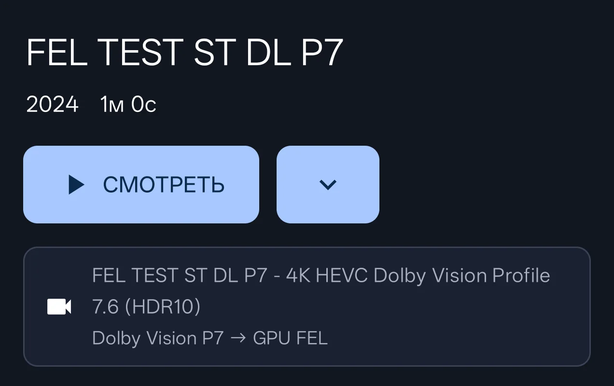
</p>
<p align="center"><sub>Ещё до запуска карточка показывает, пойдёт ли файл через GPU FEL.</sub></p>

## Каталог

### Вход

Адрес сервера, пользователь и пароль. Адрес можно ввести как угодно: `192.168.1.5`, `nas`,
`https://media.example.com`, `http://nas/jellyfin`. Схема `http://` и порт `:8096` подставятся
сами, явный порт и путь за реверс-прокси сохранятся. **Пароль не хранится** — только токен
сессии. Она переживает перезапуск и выгрузку приложения из памяти. «Выйти» отзывает токен на сервере.

### Главная

<p align="center">
  
  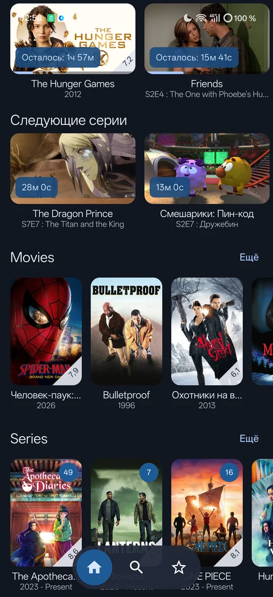
</p>

Сверху вниз:

- **Карусель новинок** — 10 последних фильмов и сериалов: фон, логотип, рейтинг, жанры, год. Листается свайпом или стрелками пульта.
- **Медиатеки** — плитки всех библиотек сервера.
- **Продолжить просмотр** — с плашкой «Осталось: 1ч 12м» и полоской прогресса. Позиция общая со всеми клиентами Jellyfin.
- **Следующие серии** — что смотреть дальше в начатых сериалах.
- **Новое по каждой медиатеке** с кнопкой «Ещё».

На постерах: рейтинг в уголке, синий кружок с числом непросмотренных серий, полоска прогресса.
Потяните экран вниз, чтобы обновить.

**Меню карточки** — долгое нажатие (на пульте зажатая OK или кнопка Menu): открыть, открыть сериал,
отметить просмотренным или непросмотренным, добавить в избранное или убрать оттуда,
убрать из «Продолжить просмотр» (позиция сбрасывается, без отметки «просмотрено»),
скрыть серию из «Следующих серий», скрыть медиатеку с главной.
Всё скрытое возвращается в настройках, раздел «Главная».

### Медиатеки: сортировка и фильтры

<p align="center">
  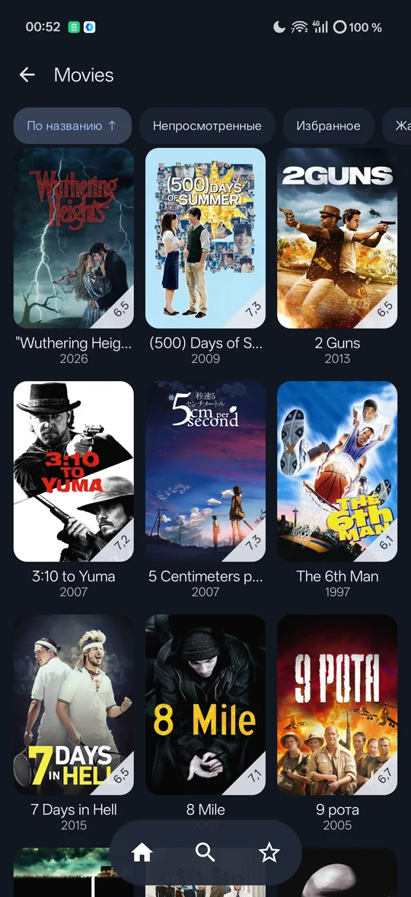
  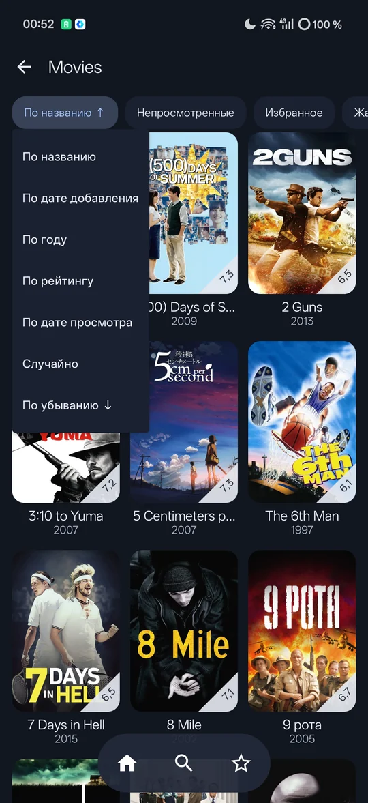
</p>

- **Сортировка:** по названию, дате добавления, году, рейтингу, дате просмотра, случайно; по возрастанию или убыванию.
- **Фильтры-чипы:** «Непросмотренные», «Избранное», «Жанр».
- Бесконечная прокрутка страницами по 60. Если страница не загрузилась, повтор сам.
- Те же экраны открываются для коллекций и папок, для жанра (тап по жанру в карточке)
  и для персоны (тап по актёру или режиссёру — его фильмография, новые сверху).

### Поиск

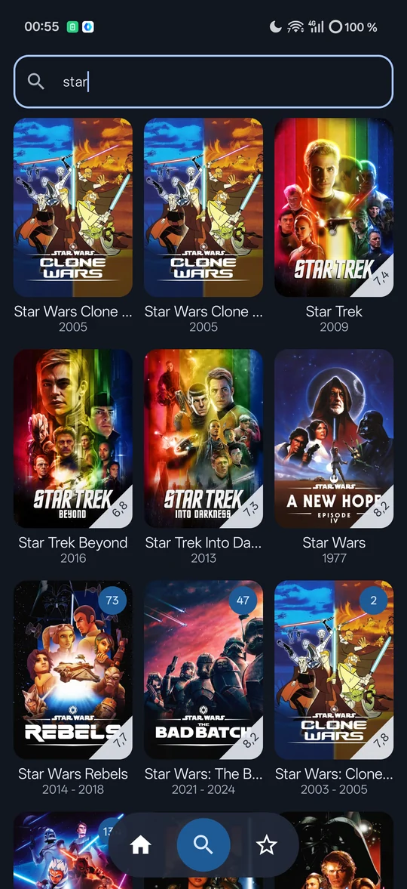

Фильмы, сериалы и серии. Поиск запускается сам через долю секунды после ввода, без кнопки «Найти».
Результаты показываются сеткой постеров с рейтингом и счётчиком непросмотренных серий.

### Избранное

Всё, что отмечено сердечком на сервере: фильмы, сериалы, серии. Список общий с другими
клиентами Jellyfin.

<br clear="right">

### Карточка фильма и сериала

<p align="center">
  
  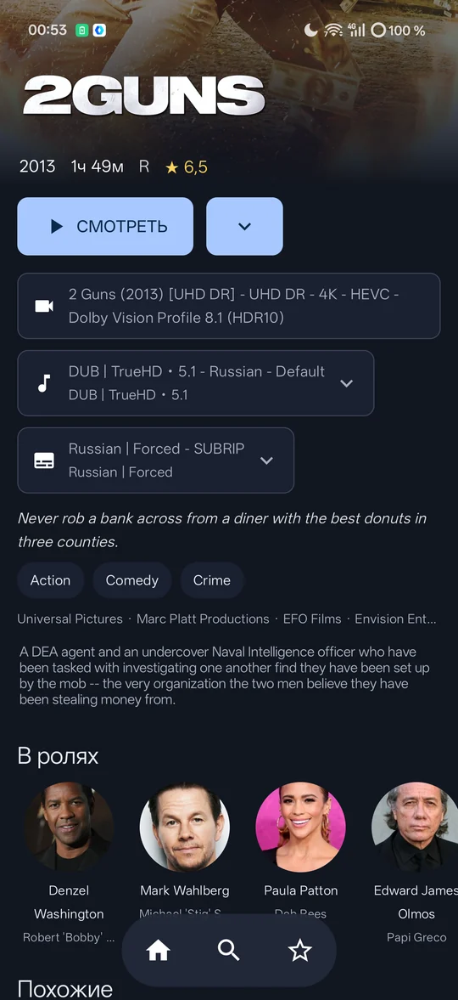
  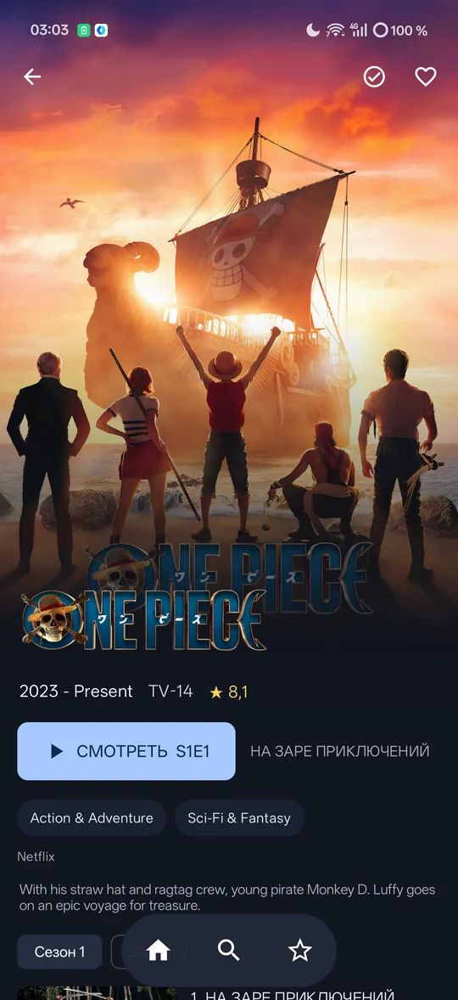
</p>
<p align="center">
  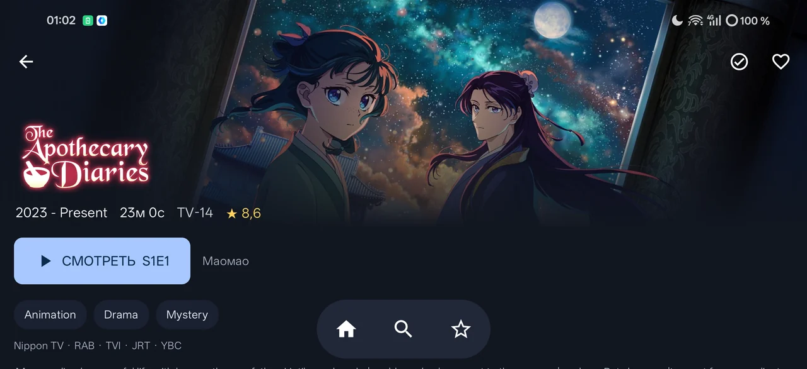
</p>
<p align="center"><sub>На широком экране (ТВ, планшет, телефон в альбомной ориентации) вместо постера — фон во всю ширину.</sub></p>

**Фильм:**
- Логотип, год, длительность, возрастной рейтинг, ★ рейтинг и 🍅 Rotten Tomatoes.
- «СМОТРЕТЬ» или «ПРОДОЛЖИТЬ 1:02:33». В меню рядом: «Смотреть с начала», «Отметить просмотренным».
- **Дорожки прямо на карточке:** версия файла (если их несколько, с размером в ГБ), видео,
  звук и субтитры. Выбор запоминается и уходит в плеер.
- Для Dolby Vision P7 видно заранее: «Dolby Vision P7 → GPU FEL» или причина, почему GPU FEL недоступен.
- Слоган, жанры, студии, описание, «В ролях» (до 30 человек), «Похожие».
- Кнопки «Просмотрено» и «Избранное» в шапке.

**Сериал:**
- «СМОТРЕТЬ S1E1» / «ПРОДОЛЖИТЬ S2E3» запускает ровно ту серию, на которой вы остановились.
- Чипы сезонов. Сразу открывается первый сезон с непросмотренными сериями.
- Список серий с кадром, описанием, длительностью, галочкой просмотренной и прогрессом.
  **Тап по кадру сразу запускает серию**, тап по строке открывает карточку серии.

## Плеер

### Экран и кнопки

<p align="center">
  
</p>

| Где | Что |
|---|---|
| Сверху | Назад · название или логотип · чипы «Перекодирование» и «☾ 23 мин» · картинка в картинке · размер видео (вписать / заполнить / растянуть) · «Ещё» |
| Слева | Блокировка экрана: жесты отключаются, тап показывает только «Разблокировать» |
| В центре | −10 с · пауза · +10 с (шаг настраивается) |
| Справа | Скорость от 0,25× до 3× с шагом 0,25, запоминается для тайтла |
| Снизу | Название и текущая глава · время · полоса перемотки с главами · звук · субтитры · серии · следующая серия |

Плеер восстанавливается после поворота экрана и выгрузки из памяти: позиция, скорость,
дорожки, режим перекодирования. Экран не гаснет, пока идёт видео.

<p align="center">
  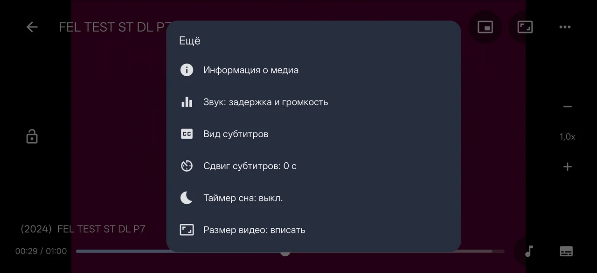
  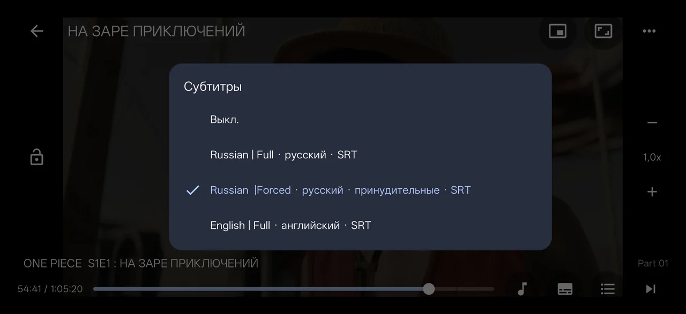
</p>

Меню **«Ещё»**: информация о медиа · главы · звук (задержка и громкость) · вид субтитров ·
сдвиг субтитров · таймер сна · размер видео.

### Жесты

- **Двойной тап** по левой трети — назад на шаг, по правой — вперёд, по центру — пауза.
- **Удержание** — временная скорость 2× («2× ▶▶»), отпустили — обычная.
- **Свайп вверх-вниз** по левой половине — яркость, по правой — громкость, с подсказкой в процентах.
  Края экрана оставлены системным жестам.

### Пульт и клавиатура

| Клавиша | Действие |
|---|---|
| ← / → | Перемотка на шаг. На полосе перемотки удержание разгоняется до 30, 60 и 120 с |
| OK | Нажать «Пропустить заставку», если она видна, иначе пауза |
| ↑ / ↓ / Menu | Показать панель управления |
| Play/Pause, Space | Пауза и воспроизведение |
| Fast forward / Rewind | Перемотка на тройной шаг |
| Next | Следующая серия |
| Captions | Выбор субтитров |
| Back / Esc | Закрыть диалог → спрятать панель → выйти |

### Звуковые дорожки и субтитры: какие выбираются сами

**Звук:**
- Язык из памяти тайтла, иначе из настроек (по умолчанию русский).
- Нет дорожки на этом языке — берётся дорожка сервера по умолчанию.
- При «Предпочитать lossless» среди дорожек нужного языка выбирается без потерь с наибольшим
  числом каналов: TrueHD, FLAC, ALAC, PCM, DTS-HD MA.

**Субтитры — режим «Когда включать»:**

| Режим | Что происходит |
|---|---|
| **Умный** (по умолчанию) | Звук не на вашем языке — полные субтитры. Звук на вашем — только принудительные (надписи, иностранная речь) |
| Всегда на моём языке | Полные субтитры, обычные раньше SDH |
| Только принудительные | Forced на языке субтитров, иначе на языке звука |
| Как на сервере | Дорожка по умолчанию из файла |
| Выключены | — |

**Память по тайтлу.** Выбрали вручную — запомнилось для этого фильма или для всего сериала:
язык звука, субтитры (или «выкл.»), forced, сдвиг субтитров, скорость. Следующие серии
стартуют с этим выбором. Хранятся последние 400 тайтлов.

### Оформление субтитров

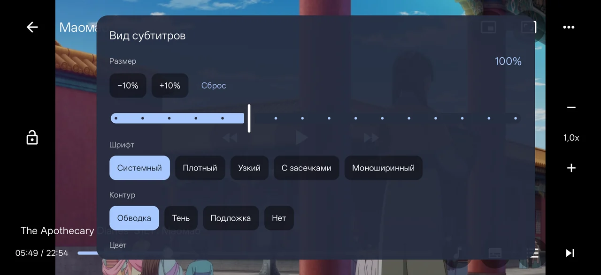

**«Вид субтитров»** меняется прямо на кадре:
- размер 50–200 %;
- шрифт: системный, плотный, узкий, с засечками, моноширинный;
- контур: обводка, тень, подложка, без контура;
- цвет: белый, жёлтый, голубой, зелёный;
- положение: ниже, обычно, выше; жирный шрифт;
- «Стили из файла (ASS, VTT)» — уважать оформление автора или показывать всё одинаково.

**Сдвиг субтитров** — шагами 0,1 и 1 с в пределах ±60 с, запоминается для тайтла.

**libass** рисует ASS/SSA с родными шрифтами, позициями и эффектами — встроенные в MKV и
внешние. Для аниме это обязательно.

**Кодировка.** Старые SRT в Windows-1251 распознаются и читаются без «кракозябр».

**Пометки для глухих.** По желанию из текстовых субтитров убираются `[музыка]`, `(стук)`, `♪…♪` и `ИМЯ:`.

Внешние субтитры с сервера подключаются как отдельные дорожки.

<br clear="right">

### Звук: задержка и усиление

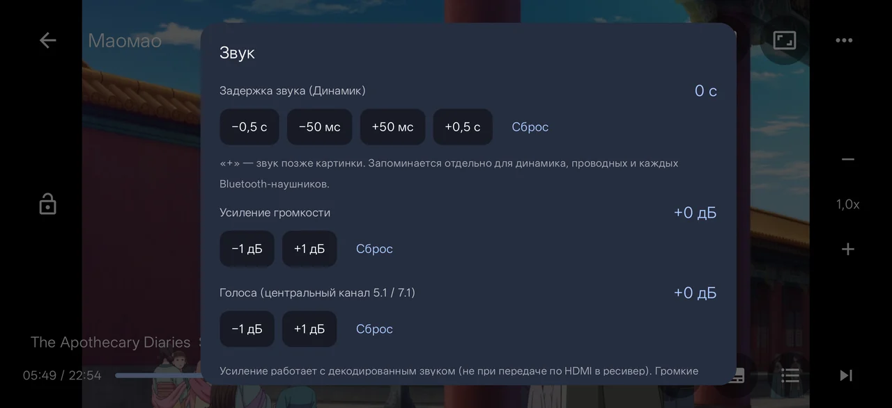

- **Задержка звука** шагами 50 мс и 0,5 с. Запоминается **отдельно для каждого устройства
  вывода**: динамик, проводные и USB-наушники, HDMI, каждые Bluetooth-наушники по имени.
  Подключили AirPods — подставилась их задержка.
- **Усиление громкости** до +12 дБ для тихих ремуксов.
- **Голоса** — отдельное усиление центрального канала 5.1/7.1, от −6 до +12 дБ.
- Пики мягко ограничиваются, без хрипа.
- **FFmpeg-декодеры** TrueHD, DTS и других форматов включаются, если на устройстве нет своих.
- Отключили наушники или пропал Bluetooth — пауза, а не внезапный звук из динамика.

<br clear="right">

### Сериалы: пропуск заставок и «Далее»

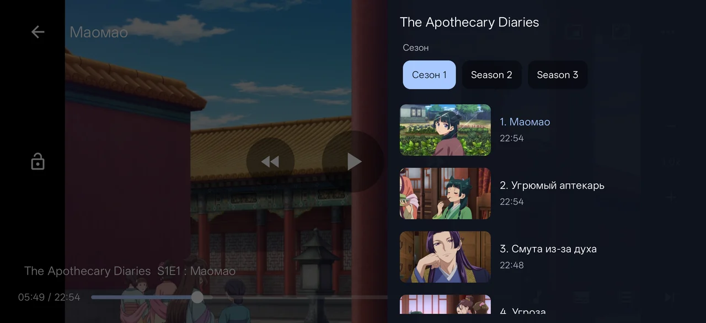

- **Пропуск отрезков** с сервера (Jellyfin 10.10+, плагин Intro Skipper): заставка, пересказ,
  титры, анонс. Кнопка «Пропустить …» или автопропуск для каждого типа отдельно.
  Если титры идут до конца файла, пропуск сразу открывает следующую серию.
- **Карточка «Далее»** появляется с началом титров (или за 40 с до конца): кадр, название,
  «Смотреть · 10» с отсчётом и «Отмена».
- **Автопереход** на следующую серию по окончании отсчёта.
- **«Вы ещё смотрите?»** — после нескольких серий подряд без касаний плеер ставит паузу и
  закрывается через минуту, если никто не ответил.
- **Панель «Серии»** прямо в плеере: сезоны, кадры, просмотренные отмечены. Тап — и серия
  запускается в том же окне.

<br clear="right">

### Перемотка: главы и превью

- **Главы** — зазоры на полосе перемотки, название текущей главы под видео, список «Главы» с переходом.
- **Превью кадров** над полосой при перетаскивании: trickplay с сервера, а если его нет —
  кадр из самого файла. На MediaTek системный извлекатель отдаёт чёрное для 4K HDR, тогда
  остаются время и глава.

### Картинка в картинке, медиакнопки, таймер сна

- **PiP** (телефон): кнопкой или автоматически при сворачивании. В окне — перемотка и пауза.
  Пропорции окна по видео.
- **MediaSession:** кнопки гарнитуры, Bluetooth-пульты, медиашторка с обложкой и названием серии.
- **Таймер сна:** 15 мин – 2 ч. За 15 с до паузы звук плавно затихает, в углу виден остаток «☾ 23 мин».

### Частота экрана

- **Телефон:** режим с частотой, кратной кадрам фильма (24p → 120 Гц), переключение без мигания.
- **ТВ:** родная частота фильма по HDMI (23,976 Гц).
- После выхода из плеера частота возвращается.

### Перекодирование и ошибки

- **Качество:** оригинал или ограничение 40/20/10/6/3 Мбит/с — сервер перекодирует в HLS
  (HEVC или H.264, AAC/AC3/EAC3) для просмотра вне дома. Графические субтитры при этом вшиваются в картинку.
- **Файл не играет** на устройстве — тост «Файл не воспроизводится напрямую — перекодирование
  на сервере» и продолжение с той же секунды.
- **Сеть пропала** — до трёх переподключений («Переподключение… (2 из 3)»).
- **Поток завис** дольше 30 с — перезапуск с той же позиции.
- Позиция, старт и остановка отправляются на сервер: «Продолжить просмотр» совпадает на всех устройствах.
- Токен передаётся в заголовке, а не в адресе потока.

### Статистика

«Ещё → Информация о медиа» — панель, обновляемая раз в секунду: разрешение, частота и кодек,
режим (прямое воспроизведение или перекодирование), битрейт, скорость сети, буфер, пропущенные
кадры, звук. Для Dolby Vision — тип слоя (FEL / MEL), путь GPU FEL, время кадра на GPU,
тон-маппинг. Тап по панели переключает отладочный вид: «BL + RPU + EL», «без EL» для сравнения
и «только остаток EL ×32».

## Android TV

- Значок и баннер в лаунчере Android TV. Сенсорный экран не требуется.
- **Левая панель** навигации с подписями и «Настройками» внизу.
- Рамка фокуса и лёгкое увеличение выбранного элемента, всё управляется пультом.
- Фокус сам встаёт на «СМОТРЕТЬ», кнопку пропуска заставки и «Смотреть» в карточке «Далее».
- В плеере нет кнопок для пальцев (блокировка, PiP); панель прячется через 6 с.
- Перемотка стрелками с разгоном, частота экрана подстраивается под фильм.

## Настройки

<p align="center">
  
  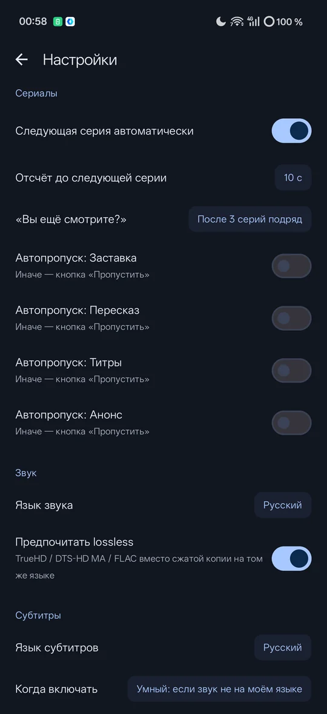
  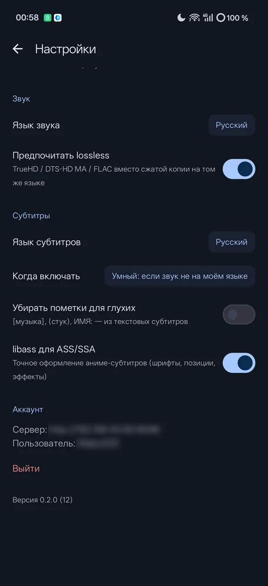
</p>

| Раздел | Настройка | По умолчанию | Варианты |
|---|---|---|---|
| Воспроизведение | Dolby Vision P7 FEL через GPU | вкл. | показывает декодер или причину недоступности |
| | Качество | Оригинал | до 40 / 20 / 10 / 6 / 3 Мбит/с |
| | Перекодировать, если файл не играет | вкл. | |
| | Буфер | Стандартный | Большой (для ремуксов 80–100 Мбит/с по Wi-Fi) |
| | Шаг перемотки | 10 с | 5 / 10 / 15 / 30 с |
| | Жесты | вкл. | |
| | Превью кадров при перемотке | вкл. | |
| Сериалы | Следующая серия автоматически | вкл. | |
| | Отсчёт до следующей серии | 10 с | 5 / 10 / 15 / 20 / 30 с |
| | «Вы ещё смотрите?» | после 3 серий | не спрашивать / 2 / 3 / 4 / 6 |
| | Автопропуск: заставка, пересказ, титры, анонс | выкл. | каждый отдельно |
| Звук | Язык звука | Русский | как в файле, английский, украинский, японский, корейский, французский, немецкий, испанский, итальянский |
| | Предпочитать lossless | вкл. | |
| Субтитры | Язык субтитров | Русский | тот же список |
| | Когда включать | Умный | как на сервере / выключены / только принудительные / всегда на моём языке |
| | Убирать пометки для глухих | выкл. | |
| | libass для ASS/SSA | вкл. | |

Задержка и усиление звука, вид субтитров и размер видео меняются в плеере и тоже сохраняются.
Внизу настроек — сервер, пользователь, «Выйти» и номер версии.

## Установка

1. Скачайте `Mittyfin-X.Y.Z.apk` со страницы [Releases](https://github.com/iMaks533/mittyfin/releases).
2. Установите на телефон или приставку (Android 10+, arm64).
3. Введите адрес своего сервера Jellyfin, пользователя и пароль.

Релизы подписаны одним ключом, поэтому новые версии ставятся поверх без потери входа и настроек.
Самостоятельно собранную debug-версию поверх релиза поставить нельзя (и наоборот): сначала удалите установленную.

## Сборка из исходников

Нужны JDK 17, Android SDK (compileSdk 36), NDK и CMake 3.22.1 для JNI-моста к libdovi.

```bash
./gradlew :app:assembleDebug
```

Тесты:

```bash
./gradlew :fel:testDebugUnitTest :app:testDebugUnitTest
```

```bash
./gradlew -p buildSrc test
```

Подписанный релиз собирается при наличии ключа. Путь и пароли задаются в `~/.gradle/gradle.properties`
(`mittyfin.storeFile`, `mittyfin.storePassword`, `mittyfin.keyAlias`, `mittyfin.keyPassword`),
без них получится неподписанный APK.

```bash
./gradlew :app:assembleRelease
```

Готовый файл: `app/build/outputs/apk/release/Mittyfin-X.Y.Z.apk`.

> Путь к проекту должен быть латиницей: Android Gradle Plugin не собирает из каталога с кириллицей.

**Устройство проекта:**

| Модуль | Что внутри |
|---|---|
| `app/` | Интерфейс на Jetpack Compose, клиент Jellyfin (REST + OkHttp), плеер на Media3 ExoPlayer: дорожки, субтитры, сериалы, PiP, MediaSession |
| `fel/` | GPU FEL: Media3-рендерер с двумя MediaCodec, разбор кадров на BL/EL/RPU, OpenGL ES-композитор и шейдеры, тон-маппинг, JNI к libdovi |
| `buildSrc/` | Версия приложения из git-тегов |

## Версии и релизы

Версия берётся из git: релиз — это тег `vX.Y.Z`. На помеченном коммите версия ровно `X.Y.Z`,
после него — `X.Y.Z-N-gхеш`, с незакоммиченными правками добавляется `-dirty`.
versionCode равен числу коммитов, поэтому каждая следующая сборка ставится поверх предыдущей.
Номер видно внизу настроек; он же уходит на сервер Jellyfin.

## Ограничения

- **GPU FEL** нужен 10-битный аппаратный HEVC с двумя сессиями 4K. На NVIDIA Shield его нет:
  там Dolby Vision P7 показывается обычным путём.
- **ColorOS** (OPPO, OnePlus) через несколько секунд без касаний опускает экран до 60 Гц
  функцией «OTI». Из приложения это не обойти.
- **Превью из файла** на MediaTek для 4K HDR недоступны — включите trickplay на сервере.
- Сборка только под **arm64-v8a**.

## Благодарности и лицензия

- [Jellyfin](https://jellyfin.org) — медиасервер и FFmpeg-декодеры для Media3
- [AndroidX Media3](https://github.com/androidx/media) — основа плеера
- [dovi_tool / libdovi](https://github.com/quietvoid/dovi_tool) — разбор RPU Dolby Vision
- [libplacebo](https://code.videolan.org/videolan/libplacebo) — образец композитора Dolby Vision
- [ass-media](https://github.com/peerless2012/libass-android) — libass для Media3
- [NuvioTV-Fork](https://github.com/ysosrs123/NuvioTV-Fork) — GPL-форк NuvioTV, из которого вырос код GPU FEL
- Интерфейс вдохновлён Yamby

Распространяется по лицензии **GNU GPL v3.0** — см. [LICENSE](LICENSE).
Dolby, Dolby Vision и логотип с двойной D — товарные знаки Dolby Laboratories.
Mittyfin не связан с Dolby Laboratories и проектом Jellyfin.
